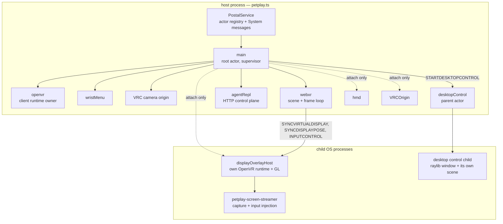
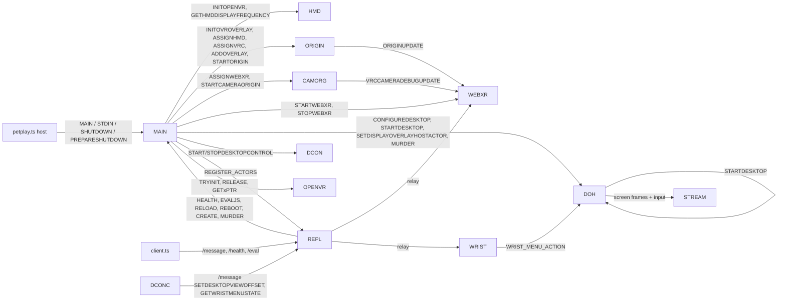
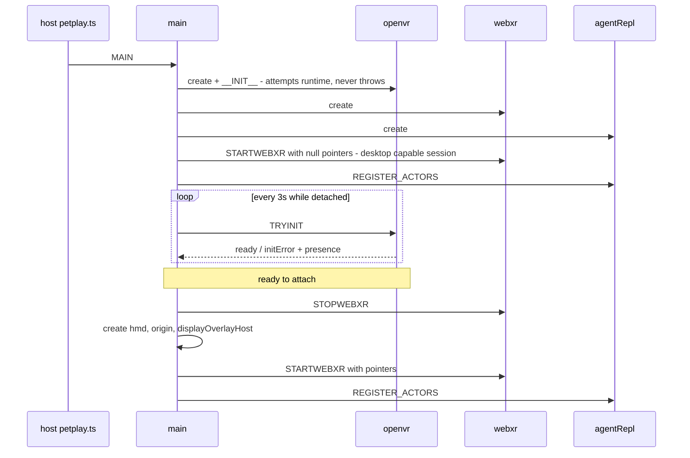
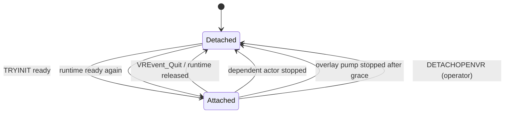
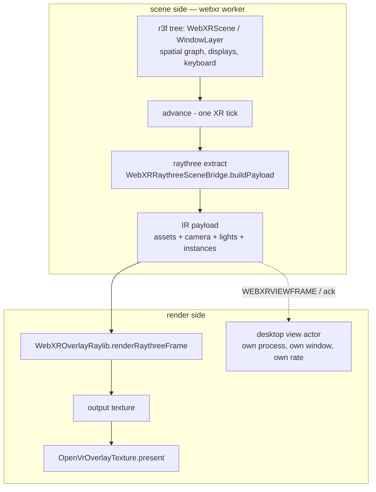
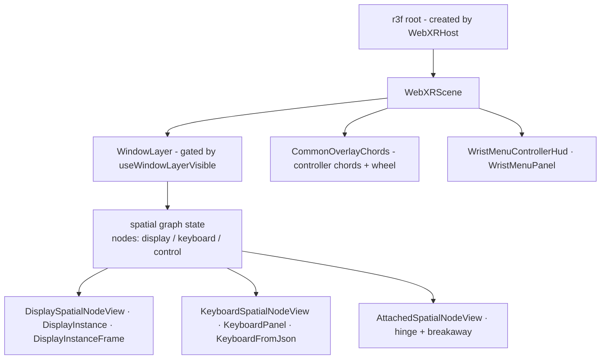

```mermaid
graph TD
  subgraph HOST["host process — petplay.ts"]
    PS["PostalService<br/>actor registry + System messages"]
    MAIN["main<br/>root actor, supervisor"]
    OPENVR["openvr<br/>client runtime owner"]
    WRIST["wristMenu"]
    CAMORG["VRC camera origin"]
    WEBXR["webxr<br/>scene + frame loop"]
    REPL["agentRepl<br/>HTTP control plane"]
    DCON["desktopControl<br/>parent actor"]
    HMD["hmd"]
    ORIGIN["VRCOrigin"]
  end
  subgraph CHILDREN["child OS processes"]
    DOH["displayOverlayHost<br/>own OpenVR runtime + GL"]
    DCONC["desktop control child<br/>raylib window + its own scene"]
    STREAM["petplay-screen-streamer<br/>capture + input injection"]
  end
  PS --> MAIN
  MAIN --> OPENVR
  MAIN --> WRIST
  MAIN --> CAMORG
  MAIN --> WEBXR
  MAIN --> REPL
  MAIN -.->|"attach only"| HMD
  MAIN -.->|"attach only"| ORIGIN
  MAIN -.->|"attach only"| DOH
  MAIN -->|"STARTDESKTOPCONTROL"| DCON
  DCON --> DCONC
  DOH --> STREAM
  WEBXR -->|"SYNCVIRTUALDISPLAY, SYNCDISPLAYPOSE, INPUTCONTROL"| DOH
```

```mermaid
graph LR
  HOSTP["petplay.ts host"] -->|MAIN / STDIN / SHUTDOWN / PREPARESHUTDOWN| MAIN
  MAIN -->|INITOPENVR, GETHMDDISPLAYFREQUENCY| HMD
  MAIN -->|INITOVROVERLAY, ASSIGNHMD, ASSIGNVRC, ADDOVERLAY, STARTORIGIN| ORIGIN
  MAIN -->|ASSIGNWEBXR, STARTCAMERAORIGIN| CAMORG
  MAIN -->|STARTWEBXR, STOPWEBXR| WEBXR
  MAIN -->|CONFIGUREDESKTOP, STARTDESKTOP, SETDISPLAYOVERLAYHOSTACTOR, MURDER| DOH
  MAIN -->|START/STOPDESKTOPCONTROL| DCON
  MAIN -->|REGISTER_ACTORS| REPL
  MAIN -->|TRYINIT, RELEASE, GETxPTR| OPENVR
  WRIST -->|WRIST_MENU_ACTION| DOH
  ORIGIN -->|ORIGINUPDATE| WEBXR
  CAMORG -->|VRCCAMERADEBUGUPDATE| WEBXR
  DOH -->|STARTDESKTOP| DOH
  DOH -->|screen frames + input| STREAM
  CLIENT["client.ts"] -->|/message, /health, /eval| REPL
  DCONC -->|"/message SETDESKTOPVIEWOFFSET, GETWRISTMENUSTATE"| REPL
  REPL -->|relay| WEBXR
  REPL -->|relay| WRIST
  REPL -->|HEALTH, EVALJS, RELOAD, REBOOT, CREATE, MURDER| MAIN
```

```mermaid
sequenceDiagram
  participant H as host petplay.ts
  participant M as main
  participant O as openvr
  participant W as webxr
  participant R as agentRepl
  H->>M: MAIN
  M->>O: create + __INIT__ - attempts runtime, never throws
  M->>W: create
  M->>R: create
  M->>W: STARTWEBXR with null pointers - desktop capable session
  M->>R: REGISTER_ACTORS
  loop every 3s while detached
    M->>O: TRYINIT
    O-->>M: ready / initError + presence
  end
  Note over M,O: ready to attach
  M->>W: STOPWEBXR
  M->>M: create hmd, origin, displayOverlayHost
  M->>W: STARTWEBXR with pointers
  M->>R: REGISTER_ACTORS
```

```mermaid
stateDiagram-v2
  [*] --> Detached
  Detached --> Attached: TRYINIT ready
  Attached --> Detached: VREvent_Quit / runtime released
  Attached --> Detached: dependent actor stopped
  Attached --> Detached: overlay pump stopped after grace
  Attached --> Detached: DETACHOPENVR (operator)
  Detached --> Attached: runtime ready again
```

```mermaid
flowchart TB
  subgraph SCENE["scene side — webxr worker"]
    R3F["r3f tree: WebXRScene / WindowLayer<br/>spatial graph, displays, keyboard"]
    ADV["advance - one XR tick"]
    EXTRACT["raythree extract<br/>WebXRRaythreeSceneBridge.buildPayload"]
    IR["IR payload<br/>assets + camera + lights + instances"]
    R3F --> ADV --> EXTRACT --> IR
  end
  subgraph RENDER["render side"]
    RASTER["WebXROverlayRaylib.renderRaythreeFrame"]
    TEX["output texture"]
    PRES["OpenVrOverlayTexture.present"]
    WIN["desktop view actor<br/>own process, own window, own rate"]
    IR --> RASTER --> TEX --> PRES
    IR -.->|"WEBXRVIEWFRAME / ack"| WIN
  end
```

```mermaid
graph TD
  ROOT["r3f root - created by WebXRHost"]
  SCENE["WebXRScene"]
  WIN["WindowLayer - gated by useWindowLayerVisible"]
  CHORDS["CommonOverlayChords - controller chords + wheel"]
  GRAPH["spatial graph state<br/>nodes: display / keyboard / control"]
  DISP["DisplaySpatialNodeView · DisplayInstance · DisplayInstanceFrame"]
  KB["KeyboardSpatialNodeView · KeyboardPanel · KeyboardFromJson"]
  ATT["AttachedSpatialNodeView · hinge + breakaway"]
  HUD["WristMenuControllerHud · WristMenuPanel"]
  ROOT --> SCENE
  SCENE --> WIN
  SCENE --> CHORDS
  SCENE --> HUD
  WIN --> GRAPH
  GRAPH --> DISP
  GRAPH --> KB
  GRAPH --> ATT
```
